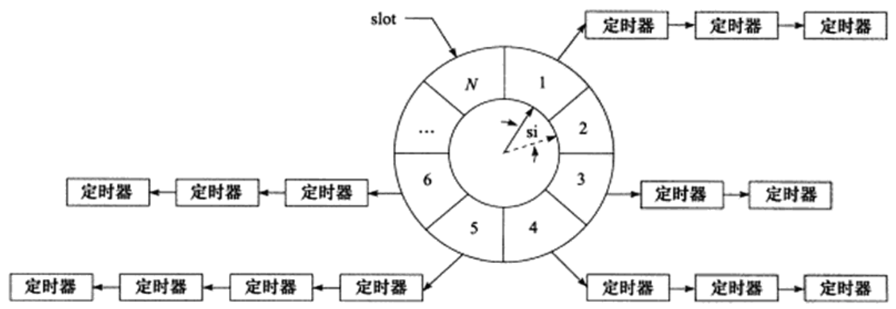

#### 时间轮
- 概述
  - 
  - 图例所示的时间轮内。（实线）指针指向轮子上的一个槽(slot)
  - 它以恒定的速度顺时针转动，每转动一步就指向下一个槽(虚线指针指向的槽)，每次转动称为一个滴答tick
  - 一个滴答的时间称为时间轮的间隔槽si(slot interval), 它实际上就是心博时间
  - 该时间轮共有N个槽，因此它运转一周的时间是 N * si
  - 槽的构成
    - 每个槽指向一条定时器链条，每条链表上的定时器具有相同的特征：它们的定时时间相差 N * si 的整数倍
    - 时间轮正是利用这个关系将定时器散列到不同的链表中
    - 假设现在指针指向槽 cs, 我们要添加一个定时时间为ti的定时器，则该定时器将插入槽(timer slot) 对应链表中: 
      - ts = (cs + (ti / si)) % N
  - 对时间轮而言，要提供定时精度，就要使si值足够小。要提高执行效率，则要求N值足够大